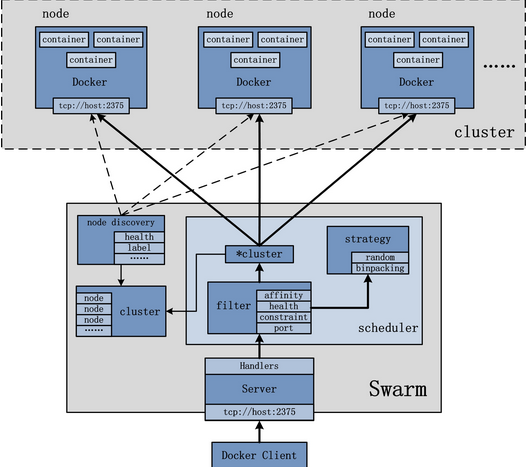
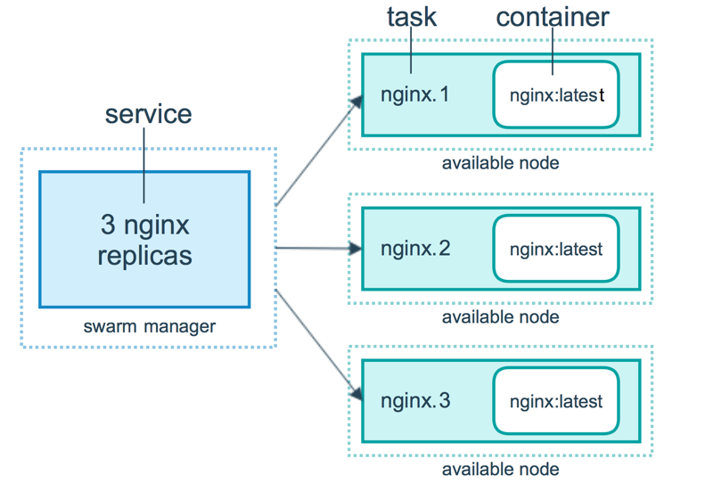
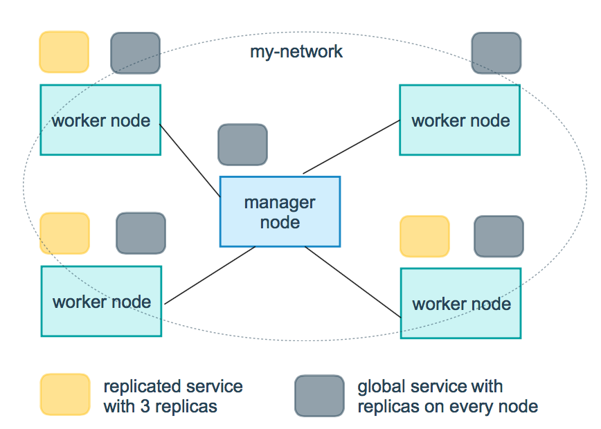

# Swarm集群部署实例

参考:[ Docker管理工具-Swarm部署记录](http://www.cnblogs.com/kevingrace/p/6870359.html)
## Swarm介绍

Swarm是Docker公司在2014年12月初发布的一套较为简单的工具，用来管理Docker集群，它将一群Docker宿主机变成一个单一的，虚拟的主机。Swarm使用标准的Docker API接口作为其前端访问入口，换言之，各种形式的Docker Client(docker client in Go, docker_py, docker等)均可以直接与Swarm通信。Swarm几乎全部用Go语言来完成开发，Swarm0.2版本增加了一个新的策略来调度集群中的容器，使得在可用的节点上传播它们，以及支持更多的Docker命令以及集群驱动。Swarm deamon只是一个调度器（Scheduler）加路由器(router)，Swarm自己不运行容器，它只是接受docker客户端发送过来的请求，调度适合的节点来运行容器，这意味着，即使Swarm由于某些原因挂掉了，集群中的节点也会照常运行，当Swarm重新恢复运行之后，它会收集重建集群信息。

Docker的Swarm(集群)模式，集成很多工具和特性，比如：跨主机上快速部署服务，服务的快速扩展，集群的管理整合到docker引擎，这意味着可以不可以不使用第三方管理工具。分散设计，声明式的服务模型，可扩展，状态协调处理，多主机网络，分布式的服务发现，负载均衡，滚动更新，安全（通信的加密）等等,下面就来认识下Swarm（对于Swarm管理的详细操作可以参考：https://www.centos.bz/tag/swarm/page/3/）
## Swarm架构
Swarm作为一个管理Docker集群的工具，首先需要将其部署起来，可以单独将Swarm部署于一个节点。另外，自然需要一个Docker集群，集群上每一个节点均安装有Docker。具体的Swarm架构图可以参照下图：

Swarm架构中最主要的处理部分自然是Swarm节点，Swarm管理的对象自然是Docker Cluster，Docker Cluster由多个Docker Node组成，而负责给Swarm发送请求的是Docker Client。
## Swarm关键概念
* Swarm
集群的管理和编排是使用嵌入到docker引擎的SwarmKit，可以在docker初始化时启动swarm模式或者加入已存在的swarm
 
* Node
一个节点(node)是已加入到swarm的Docker引擎的实例 当部署应用到集群，你将会提交服务定义到管理节点，接着Manager
管理节点调度任务到worker节点，manager节点还执行维护集群的状态的编排和群集管理功能，worker节点接收并执行来自
manager节点的任务。通常，manager节点也可以是worker节点，worker节点会报告当前状态给manager节点
 
* 服务（Service）
服务是要在worker节点上要执行任务的定义，它在工作者节点上执行，当你创建服务的时，你需要指定容器镜像
 
* 任务（Task）
任务是在docekr容器中执行的命令，Manager节点根据指定数量的任务副本分配任务给worker节点
 
--------------------------------------------------------------------------------------------------------
docker swarm：集群管理，子命令有init, join, leave, update。（docker swarm --help查看帮助）
docker service：服务创建，子命令有create, inspect, update, remove, tasks。（docker service--help查看帮助）
docker node：节点管理，子命令有accept, promote, demote, inspect, update, tasks, ls, rm。（docker node --help查看帮助）
  
node是加入到swarm集群中的一个docker引擎实体，可以在一台物理机上运行多个node，node分为：
manager nodes，也就是管理节点
worker nodes，也就是工作节点
  
* manager node管理节点：执行集群的管理功能，维护集群的状态，选举一个leader节点去执行调度任务。
* worker node工作节点：接收和执行任务。参与容器集群负载调度，仅用于承载task。
* service服务：一个服务是工作节点上执行任务的定义。创建一个服务，指定了容器所使用的镜像和容器运行的命令。
   service是运行在worker nodes上的task的描述，service的描述包括使用哪个docker 镜像，以及在使用该镜像的容器中执行什么命令。
* task任务：一个任务包含了一个容器及其运行的命令。task是service的执行实体，task启动docker容器并在容器中执行任务。
## Swarm工作方式
* Node

* Service（服务, 任务, 容器）

* 任务与调度

*　服务副本与全局服务

## Swarm调度策略
Swarm在scheduler节点（leader节点）运行容器的时候，会根据指定的策略来计算最适合运行容器的节点，目前支持的策略有：spread, binpack, random.

1）Random

顾名思义，就是随机选择一个Node来运行容器，一般用作调试用，spread和binpack策略会根据各个节点的可用的CPU, RAM以及正在运
行的容器的数量来计算应该运行容器的节点。
 
2）Spread

在同等条件下，Spread策略会选择运行容器最少的那台节点来运行新的容器，binpack策略会选择运行容器最集中的那台机器来运行新的节点。
使用Spread策略会使得容器会均衡的分布在集群中的各个节点上运行，一旦一个节点挂掉了只会损失少部分的容器。
 
3）Binpack

Binpack策略最大化的避免容器碎片化，就是说binpack策略尽可能的把还未使用的节点留给需要更大空间的容器运行，尽可能的把容器运行在
一个节点上面。
## Swarm Cluster模式的特性
1）批量创建服务

建立容器之前先创建一个overlay的网络，用来保证在不同主机上的容器网络互通的网络模式
  
2）强大的集群的容错性

当容器副本中的其中某一个或某几个节点宕机后，cluster会根据自己的服务注册发现机制，以及之前设定的值--replicas n，
在集群中剩余的空闲节点上，重新拉起容器副本。整个副本迁移的过程无需人工干预，迁移后原本的集群的load balance依旧好使！
不难看出，docker service其实不仅仅是批量启动服务这么简单，而是在集群中定义了一种状态。Cluster会持续检测服务的健康状态
并维护集群的高可用性。
  
3）服务节点的可扩展性

Swarm Cluster不光只是提供了优秀的高可用性，同时也提供了节点弹性扩展或缩减的功能。当容器组想动态扩展时，只需通过scale
参数即可复制出新的副本出来。
  
仔细观察的话，可以发现所有扩展出来的容器副本都run在原先的节点下面，如果有需求想在每台节点上都run一个相同的副本，方法
其实很简单，只需要在命令中将"--replicas n"更换成"--mode=global"即可！
 
复制服务（--replicas n）
将一系列复制任务分发至各节点当中，具体取决于您所需要的设置状态，例如“--replicas 3”。
 
全局服务（--mode=global）
适用于集群内全部可用节点上的服务任务，例如“--mode global”。如果大家在 Swarm 集群中设有 7 台 Docker 节点，则全部节点之上都将存在对应容器。
  
4）调度机制

所谓的调度其主要功能是cluster的server端去选择在哪个服务器节点上创建并启动一个容器实例的动作。它是由一个装箱算法和过滤器
组合而成。每次通过过滤器（constraint）启动容器的时候，swarm cluster 都会调用调度机制筛选出匹配约束条件的服务器，并在这上面运行容器。
  
------------------Swarm cluster的创建过程包含以下三个步骤----------------------

4-1）发现Docker集群中的各个节点，收集节点状态、角色信息，并监视节点状态的变化

4-2）初始化内部调度（scheduler）模块

4-3）创建并启动API监听服务模块
  
一旦创建好这个cluster，就可以用命令docker service批量对集群内的容器进行操作，非常方便！
  
在启动容器后，docker 会根据当前每个swarm节点的负载判断，在负载最优的节点运行这个task任务，用"docker service ls" 和"docker service ps + taskID"
可以看到任务运行在哪个节点上。容器启动后，有时需要等待一段时间才能完成容器创建。

## Swarm集群部署实例（Swarm Cluster）

* 192.168.21.205      swarm的manager节点      manager-node
* 192.168.21.176      swarm的node节点         node1
* 192.168.21.67       swarm的node节点         node2

## 设置主机名

* 在manager节点上:`$ hostnamectl --static set-hostname manager-node`
* 在node1节点上:`$ hostnamectl --static set-hostname node1`
* 在node2节点上:`$ hostnamectl --static set-hostname node2`

## 在三台机器上都要设置hosts，均执行如下命令：

<pre><code>
$  vim /etc/hosts
......
192.168.21.205 manager-node
192.168.21.176 node1
192.168.21.67 node2
</code></pre>
## 关闭三台机器上的防火墙。如果开启防火墙，则需要在所有节点的防火墙上依次放行2377/tcp（管理端口）、7946/udp（节点间通信端口）、4789/udp（overlay 网络端口）端口。

<pre><code>
$ systemctl disable firewalld.service
$ systemctl stop firewalld.service
</code></pre>
## 获得swarm镜像

<pre><code>sudo docker pull swarm</code></pre>
## 创建swarm（要保存初始化后token，因为在节点加入时要使用token作为通讯的密钥）
在manager-node上操作
<pre><code>
$ sdocker swarm init --advertise-addr 192.168.21.205
Swarm initialized: current node (1fqzwbl4qy6stp9aqo6r2j2j3) is now a manager.

To add a worker to this swarm, run the following command:

    docker swarm join --token SWMTKN-1-5f5d04wukrj289s835tdxngo82nj5l3w4rwn17rf6litsizs8y-7tob7l24uv2o2blhcj5jflfmf 192.168.21.205:2377

To add a manager to this swarm, run 'docker swarm join-token manager' and follow the instructions
</code></pre>
## 查看信息
<pre><code>
$  docker node ls          
ID                            HOSTNAME            STATUS              AVAILABILITY        MANAGER STATUS
1fqzwbl4qy6stp9aqo6r2j2j3 *   manager-node        Ready               Active              Leader
</code></pre>

## 添加节点到swarm集群中,分别在node1和node2上执行
<pre><code>
$  docker swarm join --token SWMTKN-1-5f5d04wukrj289s835tdxngo82nj5l3w4rwn17rf6litsizs8y-7tob7l24uv2o2blhcj5jflfmf 192.168.21.205:2377
    This node joined a swarm as a worker.
</code></pre>
## 查看节点群
<pre><code>
[cloudy@manager-node ~]$ docker node ls
ID                            HOSTNAME            STATUS              AVAILABILITY        MANAGER STATUS
1fqzwbl4qy6stp9aqo6r2j2j3 *   manager-node        Ready               Active              Leader
5nlvs25m2u13jtoa05ciynxd7     node1               Ready               Active              
6erve3p8x2kf75sealmjdh048     node1               Ready               Active              
</code></pre>
## 更改节点的availablity状态
<pre><code>
[cloudy@node1 ~]$ docker node update --availability drain node1           
</code></pre>
## 在Swarm中部署服务（这里以nginx服务为例）
* 启动容器之前，先来创建一个覆盖网络，用来保证在不同主机上的容器网络互通的网络模式
<pre><code>
[cloudy@manager-node ~]$ docker network create -d overlay ngx_net
z5jpu57nkrltq3rp1dbprizs4
[cloudy@manager-node ~]$ docker network ls
NETWORK ID          NAME                DRIVER              SCOPE
433588ffc6b7        bridge              bridge              local
40dfe98c9a25        docker_gwbridge     bridge              local
6fe343f18fd0        host                host                local
ut69wggu9nj5        ingress             overlay             swarm
z5jpu57nkrlt        ngx_net             overlay             swarm
d4579190e245        none                null                local
</code></pre>
* 在manager-node节点上使用上面这个覆盖网络创建nginx服务：

其中，--replicas 参数指定服务由几个实例组成。
注意：不需要提前在节点上下载nginx镜像，这个命令执行后会自动下载这个容器镜像（比如此处创建tomcat容器，就将下面命令中的镜像改为tomcat镜像）。
<pre><code>
[cloudy@manager-node ~]$  docker service create --replicas 1 --network ngx_net --name my-test -p 80:80 nginx
</code></pre>
* 查看正在运行服务的列表
<pre><code>
[cloudy@manager-node ~]$ docker service ls
</code></pre>
* 查询Swarm中服务的信息
<pre><code>
[cloudy@manager-node ~]$ docker service inspect --pretty my-test

ID:             n7v8y8y3d8i58oa300kqsa6vb
Name:           my-test
Service Mode:   Replicated
 Replicas:      1
Placement:
UpdateConfig:
 Parallelism:   1
 On failure:    pause
 Monitoring Period: 5s
 Max failure ratio: 0
 Update order:      stop-first
RollbackConfig:
 Parallelism:   1
 On failure:    pause
 Monitoring Period: 5s
 Max failure ratio: 0
 Rollback order:    stop-first
ContainerSpec:
 Image:         nginx:latest@sha256:ed3ccac7b83f0a8eb5341f9968b0c8cb85959eadaab926f336ef9bb9c1358e40
Resources:
Networks: ngx_net 
Endpoint Mode:  vip
Ports:
 PublishedPort = 80
  Protocol = tcp
  TargetPort = 80
  PublishMode = ingress 
</code></pre>