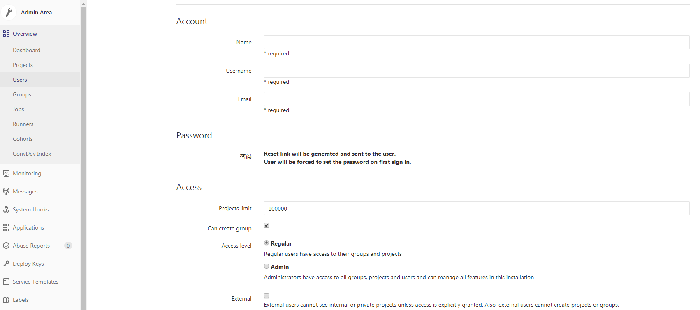
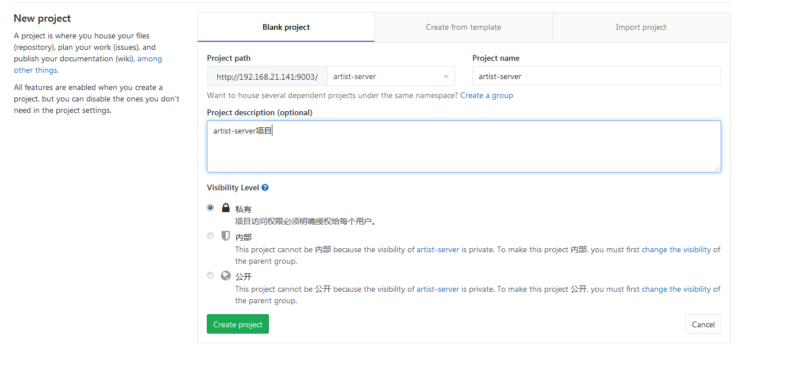
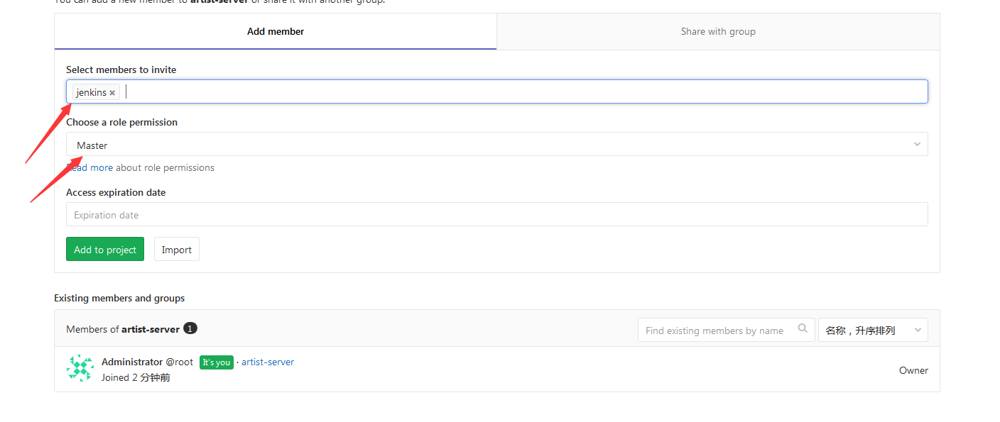
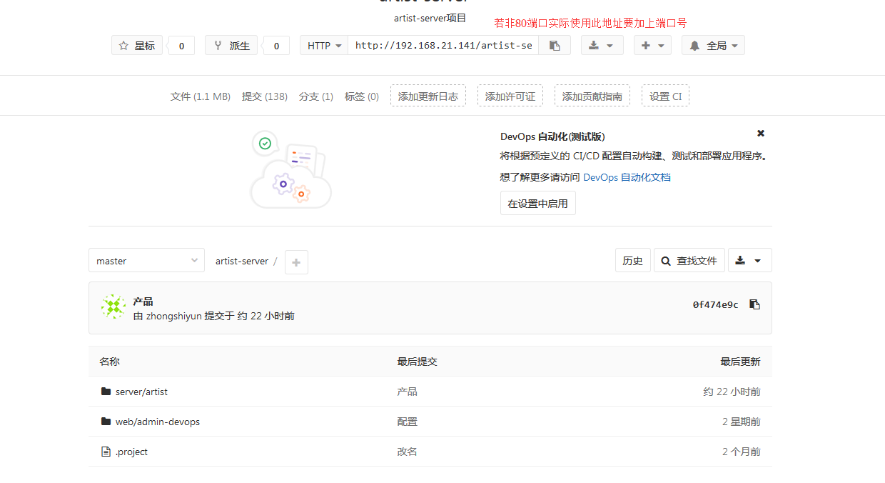

# Docker安装gitlab #

## docker仓库拉取镜像
* 搜索gitlab镜像,选择starts高的版本，此处综合考虑使用汉化的社区版
<pre><code>
$ docker search gitlab
NAME                                         DESCRIPTION                                     STARS               OFFICIAL            AUTOMATED
gitlab/gitlab-ce                             GitLab Community Edition docker image base...   1542                                    [OK]
sameersbn/gitlab                             Dockerized gitlab web server                    977                                     [OK]
gitlab/gitlab-runner                         GitLab CI Multi Runner used to fetch and r...   264                                     [OK]
gitlab/gitlab-ee                             GitLab Enterprise Edition docker image bas...   73                                      
twang2218/gitlab-ce-zh                       汉化的 GitLab 社区版 Docker Image                     70                                      [OK]
jangrewe/gitlab-ci-android                   GitLab CI image for building Android apps       32                                      [OK]
centurylink/gitlab                           This image uses the image from sameersbn /...   24                                      [OK]
</code></pre>
* gitlab镜像拉取
<pre><code>
docker pull twang2218/gitlab-ce-zh
</code></pre>
##使用gitlab/gitlab-ce镜像
* 运行gitlab(后面中文版的使用了gitlab文件夹，此处使用gitlab2)
<pre><code>
docker run -d --hostname 192.168.21.141 \ 
  -p 9044:443 -p 9003:80 -p 9023:22 \ 
  -v /srv/docker_gitlab/config:/etc/gitlab \ 
  -v /srv/docker_gitlab/logs:/var/log/gitlab \ 
  -v /srv/docker_gitlab/data:/var/opt/gitlab \ 
  --name gitlab --restart always gitlab/gitlab-ce
</code></pre>
* 浏览器进入服务
 
在浏览器中输入：宿机ip/域名：9002既可
##使用中文版镜像
本人部署启动之后发现部分页面按钮无效，js报错，新手学习docker就不跟踪原因了
### Dockerfile文件构建镜像
* 文件地址: [https://github.com/twang2218/gitlab-ce-zh](https://github.com/twang2218/gitlab-ce-zh)
* 构建镜像
<pre><code>
$ docker build -t gitlab_zh . 
</code></pre>

### docker-compose.yml方式
* 建立一个 docker-compose.yml,输入下面的内容
<pre><code>
version: '2'
services:
    gitlab:
      image: 'twang2218/gitlab-ce-zh:10.0.3'
      restart: unless-stopped
      hostname: 'gitlab.example.com'
      environment:
        TZ: 'Asia/Shanghai'
        GITLAB_OMNIBUS_CONFIG: |
          external_url 'http://gitlab.example.com'
          gitlab_rails['time_zone'] = 'Asia/Shanghai'
          # 需要配置到 gitlab.rb 中的配置可以在这里配置，每个配置一行，注意缩进。
          # 比如下面的电子邮件的配置：
          # gitlab_rails['smtp_enable'] = true
          # gitlab_rails['smtp_address'] = "smtp.exmail.qq.com"
          # gitlab_rails['smtp_port'] = 465
          # gitlab_rails['smtp_user_name'] = "xxxx@xx.com"
          # gitlab_rails['smtp_password'] = "password"
          # gitlab_rails['smtp_authentication'] = "login"
          # gitlab_rails['smtp_enable_starttls_auto'] = true
          # gitlab_rails['smtp_tls'] = true
          # gitlab_rails['gitlab_email_from'] = 'xxxx@xx.com'
      ports:
        - '8008:80'
        - '4430:443'
        - '2200:22'
      volumes:
        - config:/etc/gitlab
        - data:/var/opt/gitlab
        - logs:/var/log/gitlab
volumes:
    config:
    data:
    logs:
</code></pre>

* 运行gitlab 
<pre><code>
docker run --detach  --hostname 192.168.21.141 \
	--publish 9043:443 --publish 81:80 --publish 9022:22 \
	--volume /srv/gitlab/config:/etc/gitlab \
	--volume /srv/gitlab/logs:/var/log/gitlab \
	--volume /srv/gitlab/data:/var/opt/gitlab \
	--name gitlab --restart always gitlab/gitlab-ce
</code></pre>
* 浏览器进入服务
 
在浏览器中输入：宿机ip/域名：9002既可

ps:若宿机映射到gitlab的端口非80，在gitlab中创建的工程信息中的git地址需要加上端口号。

## gitlab操作
### 创建用户

### 创建群组

### 创建项目

### 项目添加成员
成员的role permission应为master(未测试多用户，将代码推到gitlab空项目中时需要为master权限)

###　原有代码上传
未使用80端口需要在地址中指定端口

 此处使用的操作为:
<pre><code>
$ git remote add gitlab http://192.168.21.141:9003/artist-server/artist-server.git
$ git push -u gitlab  --all
$ git push -u gitlab --tags
</code></pre>

ps:推送代码时需要输入gitlab的用户名和密码，只需要使用该项目成员为master的用户名和密码，如前面在gitlab中创建的用户jenkins,密码为：jenkinsjenkins

### 推送结果

